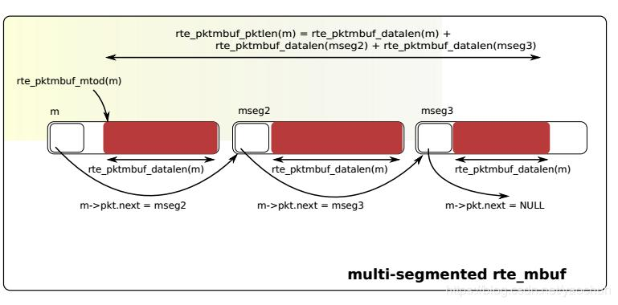
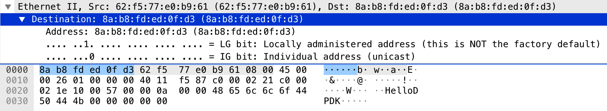
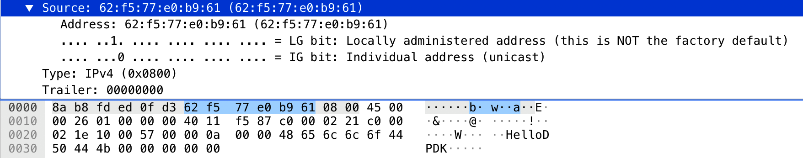
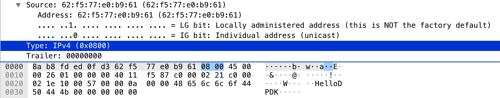
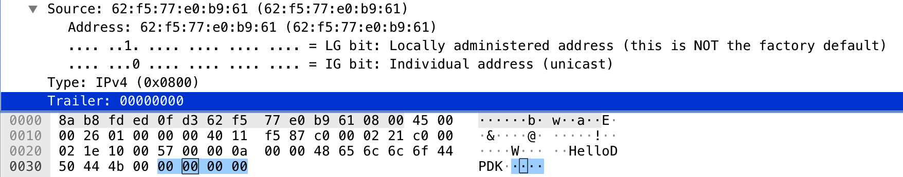
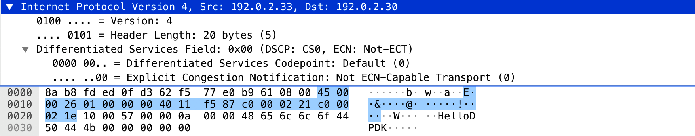
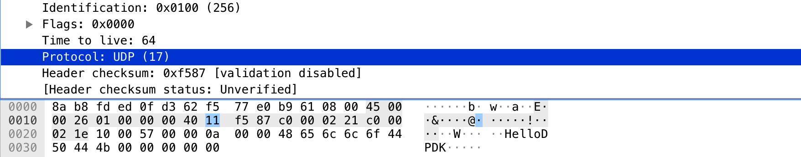
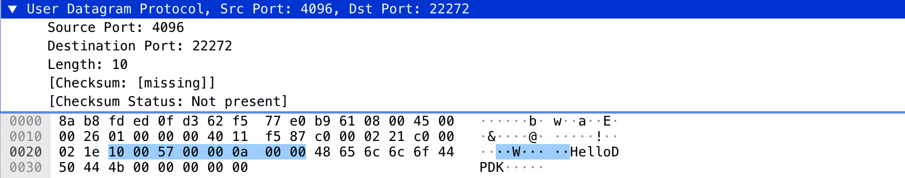

# Lab 2 DPDK

## Part 1

### Q1:What’s the purpose of using hugepage? 

Hugepage support is required for the large memory pool allocation used for packet buffers (the HUGETLBFS option must be enabled in the running kernel as indicated the previous section). By using hugepage allocations, performance is increased since fewer pages are needed, and therefore less Translation Lookaside Buffers (TLBs, high speed translation caches), which reduce the time it takes to translate a virtual page address to a physical page address. Without hugepages, high TLB miss rates would occur with the standard 4k page size, slowing performance.

### Q2: Take examples/helloworld as an example, describe the execution flow of DPDK programs? 

The first task is to initialize the Environment Abstraction Layer (EAL). This is done in the main() function using the following code:

```c
int

main(int argc, char **argv)

{
    ret = rte_eal_init(argc, argv);
    if (ret < 0)
        rte_panic("Cannot init EAL\n");
```

Once the EAL is initialized, the application is ready to launch a function on an lcore. In this example, lcore_hello() is called on every available lcore. The following is the definition of the function:

```c
static int
lcore_hello( attribute ((unused)) void *arg)
{
    unsigned lcore_id;

    lcore_id = rte_lcore_id();
    printf("hello from core %u\n", lcore_id);
    return 0;
}
```

The code that launches the function on each lcore is as follows:

```c
/* call lcore_hello() on every slave lcore */

RTE_LCORE_FOREACH_SLAVE(lcore_id) {
   rte_eal_remote_launch(lcore_hello, NULL, lcore_id);
}

/* call it on master lcore too */

lcore_hello(NULL);
```

### Q3: Read the codes of examples/skeleton, describe DPDK APIs related to sending and receiving packets. 

The related code:

```c
for (;;) {
		/*
		 * Receive packets on a port and forward them on the paired
		 * port. The mapping is 0 -> 1, 1 -> 0, 2 -> 3, 3 -> 2, etc.
		 */
		RTE_ETH_FOREACH_DEV(port) {

			/* Get burst of RX packets, from first port of pair. */
			struct rte_mbuf *bufs[BURST_SIZE];
			const uint16_t nb_rx = rte_eth_rx_burst(port, 0,
					bufs, BURST_SIZE);

			if (unlikely(nb_rx == 0))
				continue;

			/* Send burst of TX packets, to second port of pair. */
			const uint16_t nb_tx = rte_eth_tx_burst(port ^ 1, 0,
					bufs, nb_rx);

			/* Free any unsent packets. */
			if (unlikely(nb_tx < nb_rx)) {
				uint16_t buf;
				for (buf = nb_tx; buf < nb_rx; buf++)
					rte_pktmbuf_free(bufs[buf]);
			}
		}
	}
```

- `rte_eth_rx_burst(port, 0, bufs, BURST_SIZE)`: for receive packets from specified port and store the content in bufs with max size of BURST_SIZE and return the real content size.
- `rte_eth_tx_burst(port ^ 1, 0, bufs, nb_rx)`: for send packets to specified port and the packet content is located in bufs, the size is nb_rx.

### Q4: Describe the data structure of ‘rte_mbuf’. 

Source code:

```c
struct rte_mbuf {
        MARKER cacheline0;

        void *buf_addr;           
        phys_addr_t buf_physaddr __rte_aligned(sizeof(phys_addr_t));

        /* next 8 bytes are initialised on RX descriptor rearm */
        MARKER64 rearm_data;
        uint16_t data_off;

        RTE_STD_C11
        union {
                rte_atomic16_t refcnt_atomic; 
                uint16_t refcnt;              
        };
        uint16_t nb_segs;         
        uint16_t port;

        uint64_t ol_flags;        
        /* remaining bytes are set on RX when pulling packet from descriptor */
        MARKER rx_descriptor_fields1;

        /*
         * The packet type, which is the combination of outer/inner L2, L3, L4
         * and tunnel types. The packet_type is about data really present in the
         * mbuf. Example: if vlan stripping is enabled, a received vlan packet
         * would have RTE_PTYPE_L2_ETHER and not RTE_PTYPE_L2_VLAN because the
         * vlan is stripped from the data.
         */
        RTE_STD_C11
        union {
                uint32_t packet_type; 
                struct {
                        uint32_t l2_type:4; 
                        uint32_t l3_type:4; 
                        uint32_t l4_type:4; 
                        uint32_t tun_type:4; 
                        uint32_t inner_l2_type:4; 
                        uint32_t inner_l3_type:4; 
                        uint32_t inner_l4_type:4; 
                };
        };

        uint32_t pkt_len;         
        uint16_t data_len;        
        uint16_t vlan_tci;

        union {
                uint32_t rss;     
                struct {
                        RTE_STD_C11
                        union {
                                struct {
                                        uint16_t hash;
                                        uint16_t id;
                                };
                                uint32_t lo;
                        };
                        uint32_t hi;
                } fdir;           
                struct {
                        uint32_t lo;
                        uint32_t hi;
                } sched;          
                uint32_t usr;     
        } hash;                   
        uint16_t vlan_tci_outer;

        uint16_t buf_len;         
        uint64_t timestamp;

        /* second cache line - fields only used in slow path or on TX */
        MARKER cacheline1 __rte_cache_min_aligned;

        RTE_STD_C11
        union {
                void *userdata;   
                uint64_t udata64; 
        };

        struct rte_mempool *pool; 
        struct rte_mbuf *next;    
        /* fields to support TX offloads */
        RTE_STD_C11
        union {
                uint64_t tx_offload;       
                __extension__
                struct {
                        uint64_t l2_len:7;
                        uint64_t l3_len:9; 
                        uint64_t l4_len:8; 
                        uint64_t tso_segsz:16; 
                        /* fields for TX offloading of tunnels */
                        uint64_t outer_l3_len:9; 
                        uint64_t outer_l2_len:7; 
                        /* uint64_t unused:8; */
                };
        };

        uint16_t priv_size;

        uint16_t timesync;

        uint32_t seqn;

} __rte_cache_aligned;
```

| Field                        | Explanation                                                  |
| ---------------------------- | ------------------------------------------------------------ |
| void* buf_addr               | Virtual address of segment buffer.                           |
| rte_atomic16_t refcnt_atomic | Atomically accessed refcnt                                   |
| uint16_t refcnt              | Non-atomically accessed refcnt                               |
| RTE_STD_C11 { ... }          | Reference counter. Its size should at least equal to the size of port field (16 bits), to support zero-copy broadcast. It should only be accessed using the following functions: rte_mbuf_refcnt_update(), rte_mbuf_refcnt_read(), and rte_mbuf_refcnt_set(). The functionality of these functions (atomic, or non-atomic) is controlled by the CONFIG_RTE_MBUF_REFCNT_ATOMIC config option. |
| uint16_t nb_segs             | Number of segments.                                          |
| uint16_t port                | Input port (16 bits to support more than 256 virtual ports). |
| uint64_t ol_flags            | Offload features.                                            |
| uint32_t packet_type         | L2/L3/L4 and tunnel information.                             |
| uint32_t l2_type             | (Outer) L2 type.                                             |
| uint32_t l3_type             | (Outer) L3 type.                                             |
| uint32_t l4_type             | (Outer) L4 type.                                             |
| uint32_t tun_type            | Tunnel type.                                                 |
| uint32_t inner_l2_type       | Inner L2 type.                                               |
| uint32_t inner_l3_type       | Inner L3 type.                                               |
| uint32_t inner_l4_type       | Inner L4 type.                                               |
| uint32_t pkt_len             | Total pkt len: sum of all segments.                          |
| uint16_t data_len            | Amount of data in segment buffer.                            |
| uint16_t vlan_tci            | VLAN TCI (CPU order), valid if PKT_RX_VLAN_STRIPPED is set   |
| uint32_t rss                 | RSS hash result if RSS enabled                               |
| ...                          | ...                                                          |

When the struct rte_mbuf structure is defined, the more the members are, the more it intends to span the size of the two cache lines.
Marks two cache lines through MARKER cacheline0 and MARKER cacheline1. The variables between cacheline0 and cacheline1 are in cache line 0. In principle, basic and frequently accessed data will be placed. Inside cacheline0, the members after cacheline1 are in cache line1.



## Part 2

### 1. Construct UDP packets with DPDK according to the definition of UDP/IP/Ethernet header.

First, according to UDP protocol, a UDP packet is composed of `data`, `udp_header`, `ipv4_header` and `ether_hdr` from inner to outer.


So I defined a structure `Packet` to store the whole data:

```c
//定义报文信息
struct Message {
	char data[10];
};

#pragma pack(1)
struct Packet
{
    struct rte_ether_hdr ether_hdr;
    struct rte_ipv4_hdr ipv4_hdr;
    struct rte_udp_hdr udp_hdr;
    struct Message msg;
    struct rte_vlan_hdr vlan_hdr;
};
#pragma pop()
```

And I wrote a function to construct a UDP packet:

```c
static inline void
constructUDP(struct Packet *packet)
{
  // construct message
	packet->msg.data[0] = 'H';	
	packet->msg.data[1] = 'e';
	packet->msg.data[2] = 'l';
	packet->msg.data[3] = 'l';
	packet->msg.data[4] = 'o';
	packet->msg.data[5] = 'D';
	packet->msg.data[6] = 'P';
	packet->msg.data[7] = 'D';
	packet->msg.data[8] = 'K';

  // construct udp header
	packet->udp_hdr.src_port = 16; // randomly wrote for check
	packet->udp_hdr.dst_port = 87; // randomly wrote for check
  packet->udp_hdr.dgram_len = htons(sizeof(struct Message));
  packet->udp_hdr.dgram_cksum = 0;

  // construct ipv4 header
	packet->ipv4_hdr.version_ihl = 0x45; // this should be split to observe
  // 0100 for version; 0101 for 5 which means the total header length is 20 bytes.
  
	packet->ipv4_hdr.type_of_service = 0x00;
	packet->ipv4_hdr.total_length = htons(20 + (rte_be16_t)(sizeof(struct rte_udp_hdr)) + (rte_be16_t)(sizeof(struct Message)));
	packet->ipv4_hdr.packet_id = 1;
	packet->ipv4_hdr.fragment_offset = 0;
	packet->ipv4_hdr.time_to_live = 64;
	packet->ipv4_hdr.next_proto_id = 17; // UDP protocol id
	inet_pton(AF_INET, "192.0.2.33", &(packet->ipv4_hdr.src_addr));
	inet_pton(AF_INET, "192.0.2.30", &(packet->ipv4_hdr.dst_addr));
	packet->ipv4_hdr.hdr_checksum = rte_ipv4_cksum(&(packet->ipv4_hdr)); // rte_ipv4 provided cksum function

	rte_eth_random_addr(packet->ether_hdr.s_addr.addr_bytes); // generage random MAC
	rte_eth_random_addr(packet->ether_hdr.d_addr.addr_bytes);
	packet->ether_hdr.ether_type = htons(RTE_ETHER_TYPE_IPV4); // set ether type to ipv4
	
}
```

### 2.Write a DPDK application to construct and send UDP packets.  


- ether_hdr-Destination:

  

- ether_hdr-Source:

  

- ether_hdr-Type:

  

- ether_hdr-Trailer:

  

- ipv4:

  

  

- ump_hdr:

  

  - As we can see from code and screenshot, the 0x10 = 16, 0x57 = 87 but we did not use `htons` to convert it from Little-Edian to Big-Edian, so it is translated to 4096 and 22272

- Data is `HelloDPDK`

