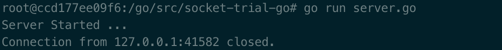
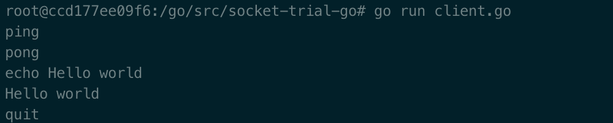

# Usage

- docker构建golang环境

  ```shell
  docker pull golang
  docker run -it -v [pathToLocalFile]:/go/src/socket-trial-go golang
  ```

  - 可能国内拉不到默认的镜像，可以手动`docker search golang`切换一个
  - 也可以用`Dockerfile`build一个镜像再运行容器

- server端

  进入`server.go`所在目录，执行

  ```shell
  go run server.go
  ```

  

- client端

  执行`docker ps`找到server运行的容器id，再执行以下指令进入容器

  ```shell
  docker exec -it [containerId] /bin/bash
  ```

  进入`client.go`所在目录，执行

  ```shell
  go run client.go
  ```

  

# Function

| 输入     | 输出                      |
| -------- | ------------------------- |
| ping     | pong                      |
| echo xxx | xxx                       |
| quit     | ----(will end connection) |

# Others

也可以运行两个容器，分别在里面运行server端和client端，只是可能需要弄一下网络组。